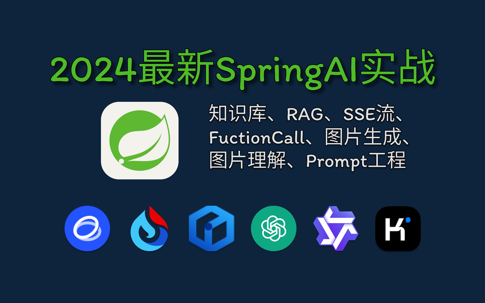
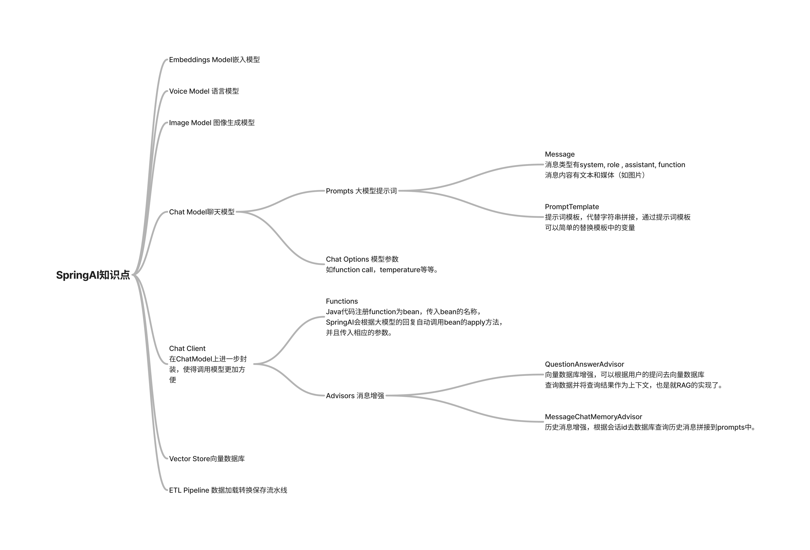

# 项目介绍

本项目使用SpringAI教学，包含了SSE流/Agent智能体/FunctionCall/Embedding/VectorDatabase/RAG/Graph RAG/历史消息/图片生成/图片理解






[文档地址](https://www.jarcheng.top/blog/project/spring-ai/intro.html)
[视频地址](https://www.bilibili.com/video/BV14y411q7RN/)

## 运行环境

- Java 17
- Node.js 18+
- MySQL 8
- DashScope API KEY（或者其他）
- Redis-Stack

  redis基础上拓展向量查询功能

    ```shell
    docker run -d \
    --name redis-stack \
    --restart=always \
    -v redis-data:/data \
    -p 6379:6379 \
    -p 8001:8001 \
    -e REDIS_ARGS="--requirepass 123456" redis/redis-stack:latest
    ```

- neo4j 5+

  安装完neo4j访问`localhost:7474`, 默认的账号密码都是`neo4j`和`neo4j`。

    ```shell
    docker run \
    -d \
    -p 7474:7474 -p 7687:7687 \
    -v neo4j-data:/data -v neo4j-data:/plugins \
    --name neo4j \
    -e NEO4J_apoc_export_file_enabled=true \
    -e NEO4J_apoc_import_file_enabled=true \
    -e NEO4J_apoc_import_file_use__neo4j__config=true \
    -e NEO4JLABS_PLUGINS=\[\"apoc\"\] \
    -e NEO4J_dbms_security_procedures_unrestricted=apoc.\\\* \
    neo4j
    ```

本地第一次启动时，建议优先确认下面两个基础前提：

- **MySQL 8 已可连接**：默认示例配置使用 `jdbc:mysql://localhost:3306/knowledge_base`，后端启动前先确认数据库、账号和密码都已准备好。
- **Node.js 18+ 与 npm 可用**：前端使用 Vite，建议先执行一次 `node -v` 和 `npm -v`，再进入 `front-end` 目录安装依赖。

## 运行步骤

### 1.clone代码

```shell
git clone https://github.com/qifan777/dive-into-spring-ai
```

### 2. idea打开项目

### 3. 修改配置文件

修改application.yml中的API-KEY, MySQL, Redis-Stack, Neo4j配置
### 4. 运行项目

后端运行

1. 运行ServerApplication.java
2. target/generated-sources/annotations右键mark directory as/generated source root

前端运行，在front-end目录下

- npm install
- npm run api （先运行后端，生成前端调用的接口类型）
- npm run dev

推荐启动顺序：

1. 先启动 MySQL / Redis-Stack / Neo4j 等依赖服务。
2. 再启动后端 `ServerApplication.java`。
3. 后端启动成功后，在 `front-end` 目录执行 `npm install`、`npm run api`、`npm run dev`。
4. 如果前端无法连通后端，优先检查后端端口 `9902` 是否已经启动，以及 `front-end/.env.development` 中的地址是否与本地环境一致。


## 联系方式

付费远程运行/安装/定制开发联系微信：ljc666max

其他关于程序运行安装报错请加QQ群：

- 416765656（满）
- 632067985
